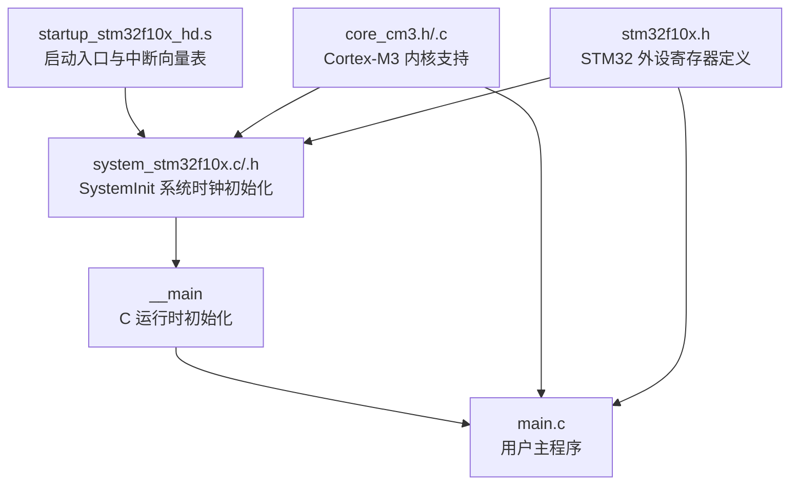
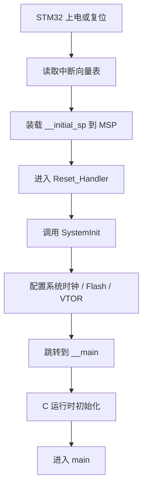
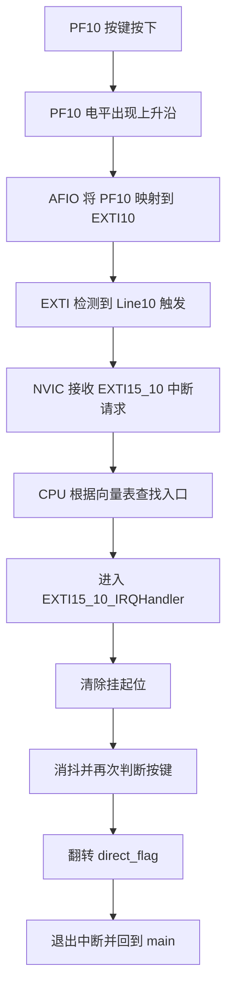

# Start 目录文件作用分析

## 1. 文档目的

这个工程的 `Start` 目录，主要负责 STM32 程序从上电复位到进入 `main()` 之前的准备工作。

它做的事情可以概括为：

- 指定上电后先执行谁
- 指定发生中断后跳到哪个函数
- 初始化系统时钟
- 提供 Cortex-M3 内核相关的寄存器和函数
- 提供 STM32F10x 芯片寄存器定义

如果把整个过程想象成“开机启动”，那么 `Start` 目录就是单片机程序的“启动层”。

---

## 2. Start 目录文件总览

`Start` 目录下有 6 个核心文件：

1. `startup_stm32f10x_hd.s`
2. `system_stm32f10x.c`
3. `system_stm32f10x.h`
4. `stm32f10x.h`
5. `core_cm3.h`
6. `core_cm3.c`

它们的分工可以先简单记成一句话：

- `startup_stm32f10x_hd.s` 负责“启动入口和中断入口”
- `system_stm32f10x.c/.h` 负责“系统时钟初始化”
- `stm32f10x.h` 负责“芯片外设寄存器定义”
- `core_cm3.h/.c` 负责“Cortex-M3 内核支持”

---

## 2.1 一图看懂 Start 目录

### 2.1.1 总体关系图

```text
                 +----------------------------------+
                 | startup_stm32f10x_hd.s          |
                 | 启动入口 + 中断向量表           |
                 +-----------------+----------------+
                                   |
                                   v
                 +----------------------------------+
                 | system_stm32f10x.c/.h           |
                 | 系统时钟初始化 SystemInit()      |
                 +-----------------+----------------+
                                   |
                                   v
                 +----------------------------------+
                 | __main                           |
                 | C 运行时环境初始化               |
                 +-----------------+----------------+
                                   |
                                   v
                 +----------------------------------+
                 | main.c                           |
                 | 用户主程序                       |
                 +----------------------------------+


       +----------------------+      +----------------------+
       | core_cm3.h/.c        |      | stm32f10x.h         |
       | Cortex-M3 内核支持    |      | STM32 外设寄存器定义 |
       +----------+-----------+      +-----------+----------+
                  \                           /
                   \                         /
                    \                       /
                     v                     v
                    为启动代码和业务代码提供底层能力
```

### 2.1.2 Mermaid 版本



---

## 3. 各文件详细作用

### 3.1 `startup_stm32f10x_hd.s`

这是启动汇编文件，也是整个工程最先参与运行的文件之一。

它的主要作用有 3 个：

1. 定义中断向量表
2. 设置初始栈顶
3. 提供复位入口 `Reset_Handler`

### 3.1.1 中断向量表

这个文件里定义了一个向量表，可以理解为“中断函数地址表”。

当某个异常或中断发生时，CPU 会根据这个表找到对应的处理函数。

例如：

- 复位时跳到 `Reset_Handler`
- 硬件错误时跳到 `HardFault_Handler`
- 外部中断 15~10 时跳到 `EXTI15_10_IRQHandler`

在这个工程里，`PF10` 按键触发的是 EXTI Line10，而 Line10 属于 `EXTI15_10_IRQHandler` 这一组，所以按键中断最终会进入你自己写的这个函数。

### 3.1.2 初始栈顶

向量表的第一个值不是函数地址，而是栈顶地址 `__initial_sp`。

CPU 上电后，会先把它装载到主栈指针 `MSP`，这样后续函数调用和中断压栈才有地方可用。

### 3.1.3 复位入口 `Reset_Handler`

单片机上电后，首先执行的是 `Reset_Handler`。

它的核心流程很清晰：

```text
Reset_Handler
    -> SystemInit()
    -> __main
    -> main()
```

其中：

- `SystemInit()` 用来做系统级初始化，主要是时钟
- `__main` 是 C 运行时入口，由编译器运行库提供
- 最终才会进入我们自己写的 `main()`

### 3.1.4 弱定义机制

这个启动文件里很多中断服务函数都写成了 `WEAK` 弱定义。

弱定义的意思是：

- 如果用户没有自己实现某个中断函数，就使用启动文件里的默认版本
- 如果用户自己写了同名函数，就自动覆盖默认版本

所以本工程中的：

- `Driver/key/Driver_Key.c` 里的 `EXTI15_10_IRQHandler()`

会覆盖 `startup_stm32f10x_hd.s` 里的弱定义版本。

这就是为什么按键中断来了之后，会执行你自己写的处理代码。

---

### 3.2 `system_stm32f10x.c`

这个文件负责系统初始化，重点是时钟初始化。

它最重要的函数是：

- `SystemInit()`
- `SystemCoreClockUpdate()`

以及一个全局变量：

- `SystemCoreClock`

### 3.2.1 `SystemInit()`

`SystemInit()` 会在 `Reset_Handler` 中被最先调用。

它主要做这些事情：

1. 把 RCC 时钟配置恢复到默认复位状态
2. 关闭或清理旧的时钟配置
3. 配置系统时钟源和分频器
4. 设置 Flash 等待周期
5. 设置中断向量表地址 `SCB->VTOR`

也就是说，这个函数相当于给芯片“打基础”：

- 时钟先配好
- 向量表地址先放对
- 后面 `main()` 才能稳定运行

### 3.2.2 `SetSysClock()`

`SystemInit()` 内部会调用 `SetSysClock()`。

这个函数会根据工程配置，选择使用哪种时钟方案，例如：

- HSI
- HSE
- PLL 倍频到 72MHz

对 STM32F103 来说，这一步非常关键，因为：

- CPU 主频是多少
- APB1、APB2 外设时钟是多少
- Flash 等待周期是否匹配

都在这里决定。

### 3.2.3 `SystemCoreClock`

这个变量表示当前内核时钟频率，也就是 HCLK。

很多依赖时钟计算的功能，都可能会用到它，比如：

- 延时
- SysTick
- 串口波特率计算

### 3.2.4 `SystemCoreClockUpdate()`

如果程序后面又手动修改了时钟配置，那么 `SystemCoreClock` 这个变量不会自动变化。

这时就要调用 `SystemCoreClockUpdate()`，根据 RCC 当前寄存器值重新计算系统时钟频率。

---

### 3.3 `system_stm32f10x.h`

这是 `system_stm32f10x.c` 的头文件。

它本身不负责启动逻辑，而是对外提供接口声明。

主要内容包括：

- `extern uint32_t SystemCoreClock;`
- `extern void SystemInit(void);`
- `extern void SystemCoreClockUpdate(void);`

可以把它理解成：

- `.c` 文件里写真正实现
- `.h` 文件里把这些能力声明出来，供其他文件使用

---

### 3.4 `stm32f10x.h`

这是 STM32F10x 芯片头文件，可以理解为“芯片寄存器说明书的代码版”。

它的作用非常大，主要负责：

1. 定义中断号
2. 定义各个外设寄存器结构体
3. 定义外设基地址
4. 定义寄存器位操作宏

### 3.4.1 中断号定义

例如：

- `EXTI0_IRQn`
- `EXTI15_10_IRQn`
- `USART1_IRQn`

这些编号后面会被 `NVIC_EnableIRQ()`、`NVIC_SetPriority()` 之类的函数使用。

### 3.4.2 外设寄存器结构体

例如：

- `GPIO_TypeDef`
- `RCC_TypeDef`
- `EXTI_TypeDef`

这些结构体让我们可以写出下面这样的代码：

```c
RCC->APB2ENR |= RCC_APB2ENR_AFIOEN;
GPIOF->CRH &= ~GPIO_CRH_MODE10;
EXTI->IMR |= EXTI_IMR_MR10;
```

这些语句之所以成立，就是因为 `stm32f10x.h` 已经把寄存器地址和结构体成员都定义好了。

### 3.4.3 外设地址映射

比如：

- `GPIOA_BASE`
- `GPIOF_BASE`
- `EXTI_BASE`
- `RCC_BASE`

再配合：

- `#define GPIOF ((GPIO_TypeDef *) GPIOF_BASE)`
- `#define RCC   ((RCC_TypeDef *) RCC_BASE)`

就形成了我们熟悉的“寄存器对象”写法。

### 3.4.4 位定义宏

例如：

- `RCC_APB2ENR_IOPFEN`
- `EXTI_PR_PR10`
- `GPIO_IDR_IDR10`

这些宏让寄存器操作更直观，不需要直接写魔法数字。

---

### 3.5 `core_cm3.h`

这是 ARM 官方 CMSIS 提供的 Cortex-M3 内核头文件。

注意，它关注的是“内核”，不是 STM32 外设本身。

它主要负责：

1. 定义 NVIC
2. 定义 SCB
3. 定义 SysTick
4. 提供内核级函数接口
5. 提供中断优先级相关函数

### 3.5.1 NVIC 相关

例如常用函数：

- `NVIC_EnableIRQ()`
- `NVIC_DisableIRQ()`
- `NVIC_SetPriority()`
- `NVIC_SetPriorityGrouping()`

这些函数本工程里已经直接用到了。

比如按键中断初始化里有：

```c
NVIC_SetPriorityGrouping(3);
NVIC_SetPriority(EXTI15_10_IRQn, 3);
NVIC_EnableIRQ(EXTI15_10_IRQn);
```

### 3.5.2 SysTick 相关

例如：

- `SysTick_Config()`

这个函数常用于系统滴答定时器初始化。

### 3.5.3 内核寄存器和指令封装

比如：

- `__enable_irq()`
- `__disable_irq()`
- `__WFI()`
- `__NOP()`

这些属于对 Cortex-M3 指令或寄存器访问的封装。

---

### 3.6 `core_cm3.c`

这个文件是 `core_cm3.h` 的部分底层实现。

它主要实现一些和汇编强相关的内核操作函数，例如：

- 读写主栈指针 `MSP`
- 读写进程栈指针 `PSP`
- 读写 `PRIMASK`
- 读写 `FAULTMASK`
- 读写 `CONTROL`

例如：

- `__get_MSP()`
- `__set_MSP()`
- `__get_PRIMASK()`
- `__set_PRIMASK()`

这个文件平时业务代码直接接触不多，但它是 CMSIS 内核支持层的一部分。

---

## 4. 程序上电到 main 的完整流程

下面是这个工程从上电到进入 `main()` 的主流程。

### 4.1 图形化启动流程

```text
+----------------------+
| STM32 上电 / 复位    |
+----------+-----------+
           |
           v
+----------------------+
| 读取中断向量表       |
+----------+-----------+
           |
           v
+----------------------+
| 装载 __initial_sp    |
| 到 MSP 主栈指针      |
+----------+-----------+
           |
           v
+----------------------+
| 进入 Reset_Handler   |
+----------+-----------+
           |
           v
+----------------------+
| 调用 SystemInit()    |
| 配置时钟/向量表地址  |
+----------+-----------+
           |
           v
+----------------------+
| 跳转到 __main        |
+----------+-----------+
           |
           v
+----------------------+
| 初始化 C 运行环境    |
+----------+-----------+
           |
           v
+----------------------+
| 进入 main()          |
+----------------------+
```

### 4.2 Mermaid 启动流程图



### 4.3 文字流程

```text
STM32 上电/复位
    ->
读取中断向量表首地址
    ->
装载初始栈顶 __initial_sp 到 MSP
    ->
跳转到 Reset_Handler
    ->
调用 SystemInit()
    ->
配置系统时钟、Flash、向量表地址
    ->
跳转到 __main
    ->
C 运行时初始化
    ->
进入 main()
```

### 4.4 关于 `__main`

`__main` 不是我们写的 `main()`。

它是编译器运行库提供的入口，主要负责：

- 初始化数据段
- 初始化 BSS 段
- 准备 C 运行环境
- 最后再调用真正的 `main()`

所以：

- `Reset_Handler` 不能直接简单理解成“马上进 main”
- 中间其实还经过了 `SystemInit()` 和 `__main`

---

## 5. 本工程按键中断的执行流程

这个工程的核心功能是：

- 按键按下后触发外部中断
- 中断里修改 `direct_flag`
- `main()` 根据 `direct_flag` 改变 LED 流水方向

下面是和本工程相关的完整中断流程。

### 5.1 图形化中断链路

```text
+----------------------+
| PF10 按键按下        |
+----------+-----------+
           |
           v
+----------------------+
| PF10 出现上升沿      |
+----------+-----------+
           |
           v
+----------------------+
| AFIO 将 PF10 映射到  |
| EXTI10               |
+----------+-----------+
           |
           v
+----------------------+
| EXTI 检测到 Line10   |
| 触发条件成立         |
+----------+-----------+
           |
           v
+----------------------+
| NVIC 接收中断请求    |
+----------+-----------+
           |
           v
+----------------------+
| CPU 查询中断向量表   |
+----------+-----------+
           |
           v
+----------------------+
| 跳转到               |
| EXTI15_10_IRQHandler |
+----------+-----------+
           |
           v
+----------------------+
| 清中断标志 / 消抖 /  |
| 翻转 direct_flag     |
+----------+-----------+
           |
           v
+----------------------+
| 返回 main() 继续跑   |
+----------------------+
```

### 5.2 Mermaid 中断流程图



### 5.3 文字流程

```text
PF10 按键被按下
    ->
PF10 电平发生上升沿
    ->
AFIO 把 PF10 映射到 EXTI10
    ->
EXTI 检测到 Line10 触发条件成立
    ->
EXTI 向 NVIC 申请中断
    ->
NVIC 判断 EXTI15_10_IRQn 已使能
    ->
CPU 暂停当前主程序
    ->
根据中断向量表跳转到 EXTI15_10_IRQHandler()
    ->
执行中断服务函数
    ->
清除 EXTI 挂起标志
    ->
修改 direct_flag
    ->
中断返回
    ->
回到 main() 继续执行
```

### 5.4 中断硬件通路速记图

```text
PF10
  |
  v
AFIO
  |
  v
EXTI10
  |
  v
NVIC
  |
  v
CPU
  |
  v
EXTI15_10_IRQHandler()
```

---

## 6. 本工程中断流程对应到具体代码

### 6.1 `main()` 的作用

`User/main.c` 中：

- 初始化 LED
- 初始化按键中断
- 在死循环里按方向依次点亮 LED

关键点是：

- `Dri_Key_Init()` 会完成 PF10 对应中断初始化
- `main()` 并不主动扫描按键
- 按键事件是“硬件触发中断”送进来的

### 6.2 `Dri_Key_Init()` 的作用

`Driver/key/Driver_Key.c` 中，`Dri_Key_Init_PF10()` 主要做了下面几步：

1. 开启 GPIOF 时钟
2. 开启 AFIO 时钟
3. 配置 PF10 为下拉输入
4. 用 AFIO 把 PF10 连接到 EXTI10
5. 配置 EXTI10 上升沿触发
6. 打开 EXTI10 的中断屏蔽
7. 在 NVIC 中配置优先级并使能 `EXTI15_10_IRQn`

这一步做完后，PF10 的硬件中断通路才算真正打通：

```text
PF10 -> AFIO -> EXTI10 -> NVIC -> CPU
```

### 6.3 `EXTI15_10_IRQHandler()` 的作用

这个函数是你自己写的按键中断服务函数。

它的主要逻辑是：

1. 判断是不是 EXTI10 触发的
2. 清除 EXTI10 挂起标志
3. 延时做消抖
4. 再次判断按键电平是否有效
5. 翻转 `direct_flag`

这里最关键的一点是：

- 一定要清中断挂起标志

否则中断可能会反复进入，程序无法正常返回主循环。

---

## 7. 这些文件之间的关系

可以把它们之间的关系理解为下面这样：

```text
startup_stm32f10x_hd.s
    负责启动入口和中断分发

system_stm32f10x.c/.h
    负责系统时钟和基础初始化

core_cm3.h/.c
    提供 Cortex-M3 内核级支持

stm32f10x.h
    提供 STM32 芯片寄存器、外设、中断号定义

main.c / Driver_Key.c / Driver_Led.c
    属于用户业务层代码
```

如果按程序执行先后顺序去理解，可以近似记成：

```text
startup_stm32f10x_hd.s
    ->
system_stm32f10x.c
    ->
__main
    ->
main.c
    ->
运行过程中按需进入 EXTI15_10_IRQHandler()
```

注意：

- `core_cm3.h/.c`
- `stm32f10x.h`

更偏向“底层支持文件”，并不是说程序会像函数链一样严格按它们的文件顺序依次执行。

它们更像是给前面这些启动和业务代码提供能力。

---

## 8. 容易混淆的几个点

### 8.1 `main()` 不是上电后第一个执行的函数

上电后先执行的是：

- 向量表
- `Reset_Handler`
- `SystemInit()`
- `__main`

最后才到 `main()`

### 8.2 `stm32f10x.h` 不是“执行文件”

它是头文件，主要作用是提供定义，不是负责控制启动流程。

### 8.3 `core_cm3.c` 不是系统时钟初始化文件

它更偏向内核寄存器和内核操作函数的实现。

系统时钟初始化主要在：

- `system_stm32f10x.c`

### 8.4 中断函数名不能随便改

比如本工程必须写成：

- `EXTI15_10_IRQHandler`

因为启动文件的向量表里登记的就是这个名字。

如果名字写错了，编译虽然可能通过，但中断来了不会进入你写的函数。

---

## 9. 一句话总结

这个工程的 `Start` 目录，本质上是在解决两个问题：

1. 芯片上电后，程序该怎么正确启动
2. 中断发生后，CPU 该跳到哪个函数去处理

其中：

- `startup_stm32f10x_hd.s` 决定“从哪里开始”和“中断跳到哪里”
- `system_stm32f10x.c` 决定“系统时钟怎么配”
- `stm32f10x.h` 决定“寄存器怎么访问”
- `core_cm3.h/.c` 决定“Cortex-M3 内核能力怎么使用”

而你这个工程里的按键中断功能，就是在这个启动层的基础上，由 `Driver_Key.c` 把 `PF10 -> EXTI10 -> NVIC -> EXTI15_10_IRQHandler()` 这条链真正接通。

---

## 10. 推荐记忆方式

如果后面复习时只想快速记住核心，可以记下面这几句：

```text
startup_stm32f10x_hd.s
    上电先执行它，里面有向量表和 Reset_Handler

system_stm32f10x.c
    Reset_Handler 先调用它做时钟初始化

__main
    C 运行时入口，最后才进 main()

stm32f10x.h
    芯片寄存器定义都在这里

core_cm3.h/.c
    NVIC、SysTick、SCB 等 Cortex-M3 内核支持在这里

EXTI15_10_IRQHandler
    是本工程按键中断最终进入的函数
```
